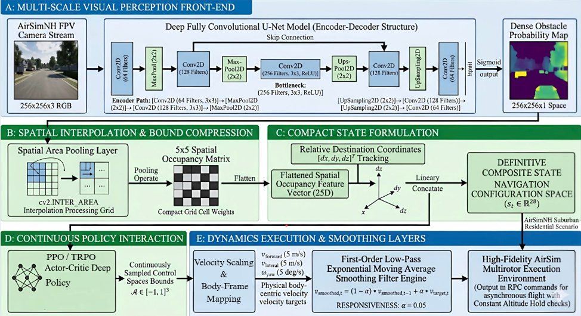
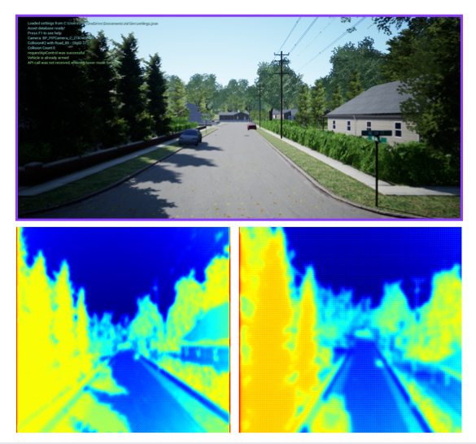
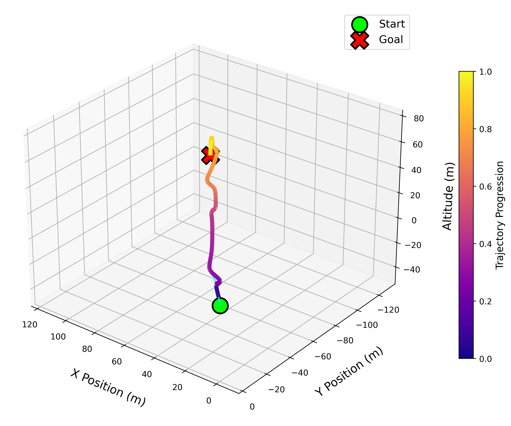
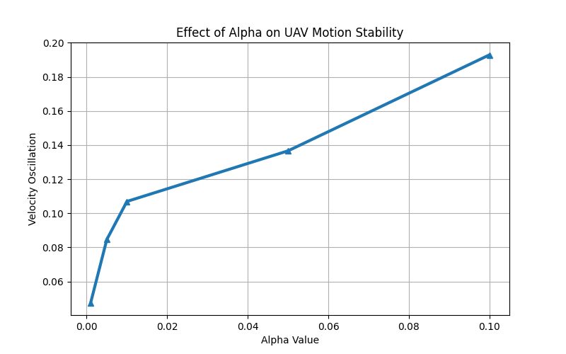
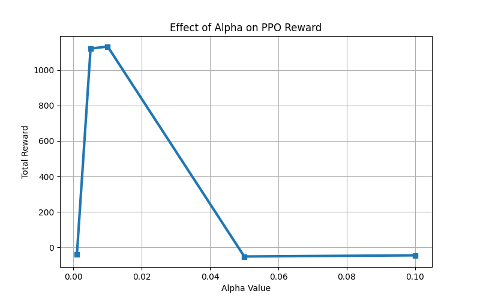
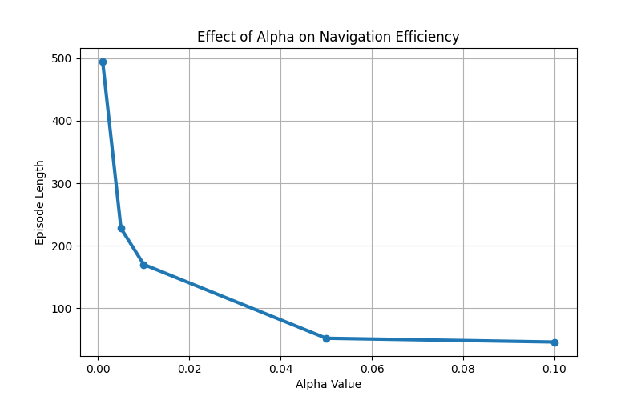
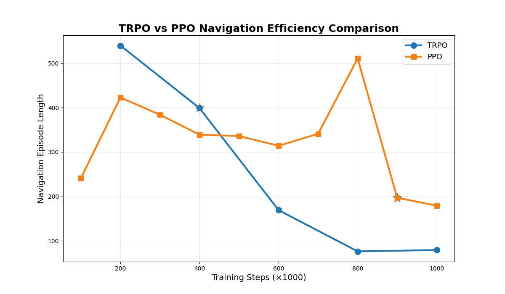

<div align="center">

```
 ██╗   ██╗ █████╗ ██╗   ██╗    ███╗   ██╗ █████╗ ██╗   ██╗
 ██║   ██║██╔══██╗██║   ██║    ████╗  ██║██╔══██╗██║   ██║
 ██║   ██║███████║██║   ██║    ██╔██╗ ██║███████║██║   ██║
 ██║   ██║██╔══██║╚██╗ ██╔╝    ██║╚██╗██║██╔══██║╚██╗ ██╔╝
 ╚██████╔╝██║  ██║ ╚████╔╝     ██║ ╚████║██║  ██║ ╚████╔╝ 
  ╚═════╝ ╚═╝  ╚═╝  ╚═══╝      ╚═╝  ╚═══╝╚═╝  ╚═╝  ╚═══╝  
```

<h1>Spatio-Visual Abstraction Layers for Smooth Map-Less UAV Navigation</h1>
<h3>via Continuous Reinforcement Learning</h3>

<br/>

<!-- [](Draft2.pdf) -->
[](https://microsoft.github.io/AirSim/)
[](https://github.com/microsoft/AirSim)
[](https://stable-baselines3.readthedocs.io/)
[](https://pytorch.org/)
[](https://python.org)
[](LICENSE)

<br/>

> **A unified spatio-visual reinforcement learning framework for smooth, map-less UAV navigation —**  
> compressing monocular RGB into compact 5×5 occupancy representations,  
> optimized via PPO/TRPO with jerk regularization and exponential velocity smoothing,  
> deployed and validated inside the AirSimNH suburban simulation environment.

<br/>

🎬 **[Watch Navigation Demo](https://drive.google.com/drive/folders/1zOAIk7mfYaNyqFdHqXwZy14-wXjR074v?usp=sharing)**

---

</div>

## 📌 Table of Contents

- [📖 Abstract](#-abstract)
- [🎯 Key Contributions](#-key-contributions)
- [🏗 System Architecture](#-system-architecture)
- [🧠 Methodology](#-methodology)
  - [U-Net Perception Front-End](#1-u-net-perception-front-end)
  - [Spatial Compression & State Space](#2-spatial-compression--state-space)
  - [Continuous Action Space](#3-continuous-action-space)
  - [Reward Formulation](#4-reward-formulation)
  - [Velocity Smoothing](#5-velocity-smoothing)
- [📊 Results & Analysis](#-results--analysis)
- [📁 Project Structure](#-project-structure)
- [🚀 Getting Started](#-getting-started)
- [📦 Requirements](#-requirements)
<!-- - [📄 Citation](#-citation) -->

---

## 📖 Abstract

Map-less autonomous UAV navigation inside complex suburban environments remains a major challenge due to high-dimensional visual observations, unstable continuous control dynamics, and insufficient spatial awareness. This work presents a **unified spatio-visual reinforcement learning architecture** that:

- Processes **monocular RGB observations** (256×256×3) through a **multi-scale U-Net** segmentation network to generate dense obstacle probability maps
- Compresses the output into a **lightweight 5×5 spatial occupancy matrix** via Spatial Area Pooling
- Fuses spatial features with relative destination coordinates into a **compact 28-dimensional navigation state**
- Optimizes **continuous body-frame velocity commands** [v_forward, v_lateral, ω_yaw] using **PPO** and **TRPO**
- Integrates **first-order exponential velocity smoothing** and **jerk regularization** to suppress trajectory oscillations

Validation inside the **AirSimNH suburban simulation environment (AirSim v5.0)** demonstrates stable target convergence, smooth trajectory generation, and effective obstacle-aware navigation under continuous control.

---

## 🎯 Key Contributions

```
┌─────────────────────────────────────────────────────────────────────┐
│  1. Spatio-Visual Abstraction Framework                             │
│     Compresses 256×256 RGB → 5×5 occupancy matrix                   │
│     while preserving multi-scale spatial awareness                  │
├─────────────────────────────────────────────────────────────────────┤
│  2. Compact 28-Dimensional RL State Space                           │
│     25D spatial occupancy + 3D relative target displacement         │
├─────────────────────────────────────────────────────────────────────┤
│  3. Smooth Continuous-Control UAV Pipeline                          │
│     PPO + TRPO with exponential smoothing + jerk regularization     │
├─────────────────────────────────────────────────────────────────────┤
│  4. Full AirSimNH Experimental Validation                           │
│     Trajectory analysis · Oscillation analysis · Visual activation  │
└─────────────────────────────────────────────────────────────────────┘
```

---

## 🏗 System Architecture

<div align="center">



*Fig. 1 — The proposed spatio-visual perception and continuous control framework. The architecture integrates U-Net perception, occupancy compression, compact RL state formulation, PPO/TRPO continuous control, and velocity smoothing for stable UAV navigation inside AirSimNH.*

</div>

```
┌────────────────────────────────────────────────────────────────────────────┐
│  A: MULTI-SCALE VISUAL PERCEPTION FRONT-END                                │
│                                                                            │
│  AirSimNH FPV ──▶ U-Net Encoder-Decoder ──▶ Dense Obstacle Probability     │
│  Camera Stream     (Skip Connections)        Map  256×256×1  [0,1]         │
│  256×256×3 RGB     Bottleneck: 64×64×256                                   │
└──────────────────────────────┬─────────────────────────────────────────────┘
                               │
┌──────────────────────────────▼─────────────────────────────────────────────┐
│  B: SPATIAL INTERPOLATION & COMPRESSION                                    │
│                                                                            │
│  256×256×1 ──▶ cv2.INTER_AREA Pooling ──▶ 5×5 Spatial Occupancy Matrix     │
│               (Spatial Area Pooling)        Flatten → 25D Feature Vector   │
└──────────────────────────────┬─────────────────────────────────────────────┘
                               │
┌──────────────────────────────▼─────────────────────────────────────────────┐
│  C: COMPACT STATE FORMULATION                                              │
│                                                                            │
│  [25D Occupancy Vector] ──┐                                                │
│                           ├──▶ Concatenate ──▶ s_t ∈ ℝ²⁸                   │
│  [dx, dy, dz] Target ─────┘    (Linear Layer)   Navigation State           │
└──────────────────────────────┬─────────────────────────────────────────────┘
                               │
┌──────────────────────────────▼─────────────────────────────────────────────┐
│  D: CONTINUOUS POLICY INTERACTION                                          │
│                                                                            │
│  PPO / TRPO Actor-Critic ──▶ Action ∈ [-1,1]³                              │
│  (Sampled Continuous)        [a_forward, a_lateral, a_yaw]                 │
└──────────────────────────────┬─────────────────────────────────────────────┘
                               │
┌──────────────────────────────▼─────────────────────────────────────────────┐
│  E: DYNAMICS EXECUTION & SMOOTHING                                         │
│                                                                            │
│  Velocity Scaling ──▶ Exponential Moving Average ──▶ AirSim v5.0 API       │
│  v_max = 5.0 m/s      v_smooth,t = (1-α)v_t-1 + αv_target   (AirSimNH)     │
│  ω_max = 5.0 deg/s    α = 0.05 (responsiveness)                            │
└────────────────────────────────────────────────────────────────────────────┘
```

---

## 🧠 Methodology

### 1. U-Net Perception Front-End

The perception front-end processes monocular RGB camera frames from AirSim v5.0 through a multi-scale encoder-decoder U-Net:

```
Input:   I ∈ ℝ^(256×256×3)   ← AirSimNH FPV camera stream

Encoder:
  (256×256×3)  →Conv→  (256×256×64)  →MaxPool→  (128×128×64)
  (128×128×64) →Conv→  (128×128×128) →MaxPool→  (64×64×128)

Bottleneck:  64×64×256  ← High-level structural features

Decoder:
  Symmetric upsampling + skip connections from encoder stages

Output:
  M_prob = σ(Conv1×1(D_block2))  ∈ ℝ^(256×256×1)
  Each coordinate = obstacle probability ∈ [0, 1]
```

<div align="center">



*Fig. 2 — Visual validation of the U-Net perception front-end. Top: raw AirSim RGB observation. Bottom: dense obstacle probability activations used for spatial occupancy compression.*

</div>

---

### 2. Spatial Compression & State Space

To reduce RL state complexity, the dense probability map is compressed using **Spatial Area Interpolation Pooling**:

```python
# Spatial Area Pooling: 256×256 → 5×5
G = cv2.resize(M_prob, (5, 5), interpolation=cv2.INTER_AREA)   # ℝ^(5×5)
V_visual = G.flatten()                                           # 25D vector

# Relative target displacement (AirSim NED frame)
d_rel = [dx, dy, dz] = goal - uav_position                      # 3D vector

# Final compact navigation state
s_t = concat([V_visual, dx, dy, dz])                            # ℝ^28
```

| Component | Dimension | Description |
|-----------|-----------|-------------|
| Spatial occupancy vector | 25D | Flattened 5×5 obstacle grid |
| Relative target displacement | 3D | [dx, dy, dz] in NED frame |
| **Total state space** | **28D** | **Compact navigation state** |

---

### 3. Continuous Action Space

```
Action vector: u_t = [a_forward, a_lateral, a_yaw]  ∈ [-1, 1]³

Physical mapping:
  v_forward = a_forward × V_max    (V_max = 5.0 m/s)
  v_lateral = a_lateral × V_max    (V_max = 5.0 m/s)
  ω_yaw     = a_yaw     × Ω_max   (Ω_max = 5.0 deg/s)

Altitude hold:
  v_z = -(z_t + H_max)             (H_max = 10.0 m)

Execution:
  moveByVelocityBodyFrameAsync()    ← AirSim v5.0 RPC API
```

**PPO** uses clipped surrogate objective (ε = 0.2):
```
L^CLIP(θ) = E[min(r_t(θ)·Â_t, clip(r_t(θ), 1-ε, 1+ε)·Â_t)]
```

**TRPO** constrains updates via KL-divergence trust region:
```
D_KL(π_θ_old ‖ π_θ) ≤ δ
```

---

### 4. Reward Formulation

The multi-modal reward combines 6 components:

```
R_total = R_progress + R_yaw + R_motion + R_obs + R_jerk + R_terminal
```

| Component | Formula | Purpose |
|-----------|---------|---------|
| **R_progress** | `(d_{t-1} - d_t) × (20 + 100/(d_t+1))` | Target convergence |
| **R_yaw** | `0.2(1 - e_θ/180°) - 0.4‖ω_yaw‖` | Directional alignment |
| **R_motion** | `0.3v_forward + 0.4‖v_smooth‖²` | Active navigation |
| **R_obs** | `-4.0·O_front - 1.0·O_global` | Obstacle avoidance |
| **R_jerk** | `-0.05‖v_target - v_smooth‖²` | Smoothness regularization |
| **R_terminal** | `+2000 / -100 / -100` | Goal / Collision / Timeout |

**Spatial quadrant obstacle computation (5×5 grid):**
```
O_front  = mean(G[0:2, 2:4])    ← Frontal safety columns
O_global = mean(G[0:5, 0:5])    ← Full occupancy density

If O_front > 0.3:  R_obs += |v_lateral|   ← Lateral escape incentive
```

---

### 5. Velocity Smoothing

First-order low-pass exponential moving average:

```
v_smooth,t = (1 - α) × v_smooth,t-1  +  α × v_target,t

α = 0.05  (responsiveness coefficient)
```

Smaller α → lower oscillations → smoother trajectories (optimal: α = 0.005–0.01)

---

## 📊 Results & Analysis

### 3D UAV Trajectory

<div align="center">



*Fig. 3 — 3D UAV trajectory generated using the proposed map-less navigation framework inside AirSimNH. Color gradient represents trajectory progression from initial position toward target destination.*

</div>

---

### Effect of Smoothing Coefficient α

<div align="center">

|  |  |
|:---:|:---:|
| *Fig. 4 — α vs. velocity oscillation magnitude* | *Fig. 5 — α vs. PPO cumulative reward* |



*Fig. 6 — α vs. navigation efficiency (episode length)*

</div>

**Quantitative summary across α values:**

| α | Velocity Oscillation | Total Reward | Episode Length |
|---|---|---|---|
| 0.001 | 0.048 | -35 | 495 |
| **0.005** | **0.084** | **1110** | **228** ✅ |
| **0.010** | **0.107** | **1125** | **170** |
| 0.050 | 0.137 | -52 | 52 |
| 0.100 | 0.193 | -48 | 47 |

> **Optimal range: α = 0.005–0.01** — best balance between control smoothness and navigation efficiency.

---

### PPO vs TRPO Navigation Efficiency

<div align="center">



*Fig. 8 — Navigation efficiency comparison between PPO and TRPO using mean episode length across training horizons (100k–1M steps).*

</div>

| Algorithm | Early Convergence | Long-Term Stability | Best Use Case |
|-----------|---|---|---|
| **PPO** | ✅ Fast | ⚠️ Higher variance | Rapid prototyping |
| **TRPO** | Slower | ✅ Superior stability | Production deployment |

---

### Comparison with Existing Methods

| Method | Visual Input | RL Algorithm | Continuous Control | Compact State | Obstacle Segmentation | Motion Smoothing |
|--------|---|---|---|---|---|---|
| Shin et al. | RGB | Actor-Critic | ✅ | ❌ | ✅ | ❌ |
| Doukhi et al. | LiDAR | DQN | ❌ | ❌ | ❌ | ❌ |
| Kabas et al. | RGB/Depth | PPO | ✅ | ❌ | ❌ | ❌ |
| Samma et al. | Depth | DQN | ❌ | ❌ | ❌ | ❌ |
| Alves et al. | Visual+Sensors | SAC | ✅ | Autoencoder | ❌ | ❌ |
| **Proposed** | **Mono RGB + U-Net** | **PPO + TRPO** | **✅** | **5×5 Occupancy** | **✅** | **✅** |

---

## 📁 Project Structure

```
Autonomous-UAV-Navigation-via-Spatio-Visual-Reinforcement-Learning/
│
├── 📄 README.md
├── 📦 requirements.txt
│
├── 🚀 final codes/                        ← Final implementation
│   ├── environment.py                     ← AirSimNH gym environment (v5.0)
│   ├── unet.py                            ← U-Net segmentation network
│   ├── train_ppo.py                       ← PPO training pipeline
│   ├── train_trpo.py                      ← TRPO training pipeline
│   ├── test_ppo.py                        ← PPO evaluation script
│   ├── test_trpo.py                       ← TRPO evaluation script
│   ├── results.py                         ← Result plotting & analysis
│   ├── utils.py                           ← Reward, smoothing, utilities
│   └── settings.json                      ← AirSim v5.0 simulation config
│
├── 📊 results/                            ← Experimental result figures
│   ├── fig1_architecture_pipeline.png     ← Full system architecture
│   ├── fig2_heatmap_unet.png              ← U-Net obstacle probability maps
│   ├── fig3_advanced_3d_uav_trajectory.png← 3D trajectory visualization
│   ├── fig4_alpha_vs_oscillation.png      ← α vs. velocity oscillation
│   ├── fig5_alpha_vs_reward.png           ← α vs. PPO reward
│   ├── fig6_alpha_vs_steps.png            ← α vs. episode length
│   ├── fig8_Steps_Efficiency.png          ← PPO vs TRPO comparison
│   └── Screenshot (1).png                ← AirSimNH navigation screenshot
│
└── 🔬 previous-workings/                  ← Research iteration history
    ├── final previous codes/              ← Iterative algorithm versions (0–6)
    ├── previous-codes/                    ← iteration history
    └── unet+ppo/                          ← U-Net + PPO integration prototype
```

---

## 🚀 Getting Started

### Prerequisites

- **AirSim v5.0** with **AirSimNH** environment binary
- Python 3.10
- CUDA-capable GPU (recommended)
- Unreal Engine 4 (optional, for custom environments)

---

### Step 1 — Install Dependencies

```bash
git clone https://github.com/yourusername/Autonomous-UAV-Navigation-via-Spatio-Visual-Reinforcement-Learning.git
cd Autonomous-UAV-Navigation-via-Spatio-Visual-Reinforcement-Learning

pip install -r requirements.txt
```

---

### Step 2 — AirSim v5.0 Setup

1. Download **AirSimNH** environment binary for your platform
2. Copy `final codes/settings.json` to your AirSim settings directory:

```bash
# Linux / macOS
cp "final codes/settings.json" ~/Documents/AirSim/settings.json

# Windows
copy "final codes\settings.json" %USERPROFILE%\Documents\AirSim\settings.json
```

3. Launch the AirSimNH executable

---

### Step 3 — Train

```bash
cd "final codes"

# Train with PPO
python train_ppo.py

# Train with TRPO
python train_trpo.py
```

Key hyperparameters (configurable in training scripts):

| Parameter | Value | Description |
|-----------|-------|-------------|
| `alpha` | 0.05 | Velocity smoothing coefficient |
| `V_max` | 5.0 m/s | Maximum forward/lateral velocity |
| `Omega_max` | 5.0 deg/s | Maximum yaw rate |
| `H_max` | 10.0 m | Navigation altitude |
| `max_steps` | 350 | Episode step limit |
| State dim | 28 | 25D occupancy + 3D displacement |

---

### Step 4 — Test & Evaluate

```bash
# Test PPO policy
python test_ppo.py

# Test TRPO policy
python test_trpo.py

# Generate result plots
python results.py
```

---

## 📦 Requirements

```txt
airsim
torch
torchvision
numpy
opencv-python
gymnasium
stable-baselines3
scipy
matplotlib
```

Install all dependencies:
```bash
pip install -r requirements.txt
```

<!--
---

## 📄 Citation

If you find this work useful, please cite:

```bibtex
@article{adam2025spatiovisual,
  title     = {Spatio-Visual Abstraction Layers for Smooth Map-Less UAV Navigation 
               via Continuous Reinforcement Learning},
  author    = {Adam, Koda and Kumar BN, Pavan},
  institution = {Indian Institute of Information Technology, Sri City},
  year      = {2025}
}
```
-->

---

## 🔭 Future Work

- Multi-modal sensor fusion (RGB + LiDAR/Depth)
- Domain randomization for sim-to-real transfer
- Real-world UAV deployment (outdoor dynamic environments)
- Multi-agent cooperative navigation
- Temporal memory integration (LSTM/Transformer state encoding)

---

<div align="center">

**From pixels to flight paths — no maps, no LiDAR, no shortcuts.**

*U-Net · PPO · TRPO · AirSim v5.0 · AirSimNH · Continuous RL · Spatio-Visual Abstraction*

<br/>

🎬 **[Watch the Full Navigation Demo](https://drive.google.com/drive/folders/1zOAIk7mfYaNyqFdHqXwZy14-wXjR074v?usp=sharing)**

</div>
